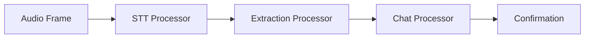

# Recipe: Voice to Chat Pipeline

This recipe shows how to build a pipeline that receives voice messages and posts summaries to a chat platform.

## Use Case

1. User sends voice message (e.g., via WhatsApp)
2. Pipeline transcribes the audio
3. LLM extracts key information
4. Summary is posted to team chat (e.g., Zulip)

## Prerequisites

```bash
pip install knomly

# API Keys needed:
# - KNOMLY_GEMINI_API_KEY (for STT)
# - KNOMLY_OPENAI_API_KEY (for LLM)
# - KNOMLY_ZULIP_API_KEY (for chat)
```

## Pipeline Architecture



## Implementation

### Step 1: Create the Processors

```python
from knomly.pipeline.processors.base import Processor, ProcessorResult
from knomly.pipeline.frames.base import Frame

class TranscriptionProcessor(Processor):
    """Transcribes audio to text using STT provider."""

    @property
    def name(self) -> str:
        return "transcription"

    async def process(self, frame: Frame, ctx) -> ProcessorResult:
        if frame.frame_type != "audio":
            return ProcessorResult.skip("Not audio")

        # Get STT provider from context
        stt = ctx.providers.get_stt()
        audio_bytes = frame.data["audio_bytes"]
        mime_type = frame.data.get("mime_type", "audio/ogg")

        # Transcribe
        result = await stt.transcribe(audio_bytes, mime_type=mime_type)

        # Return transcription frame
        return ProcessorResult.ok(Frame.create(
            "transcription",
            data={"text": result.text, "language": result.language},
            metadata=frame.metadata,
        ))


class ExtractionProcessor(Processor):
    """Extracts structured information using LLM."""

    @property
    def name(self) -> str:
        return "extraction"

    async def process(self, frame: Frame, ctx) -> ProcessorResult:
        if frame.frame_type != "transcription":
            return ProcessorResult.skip("Not transcription")

        llm = ctx.providers.get_llm()
        text = frame.data["text"]

        # Extract summary
        from knomly.providers.llm import Message, LLMConfig

        response = await llm.complete(
            messages=[
                Message.system(
                    "Extract key information from this message. "
                    "Return a brief summary suitable for a team update."
                ),
                Message.user(text),
            ],
            config=LLMConfig(temperature=0.3),
        )

        return ProcessorResult.ok(Frame.create(
            "extraction",
            data={
                "original_text": text,
                "summary": response.content,
            },
            metadata=frame.metadata,
        ))


class ChatPostProcessor(Processor):
    """Posts extracted summary to chat platform."""

    def __init__(self, stream: str, topic: str):
        self._stream = stream
        self._topic = topic

    @property
    def name(self) -> str:
        return "chat_post"

    async def process(self, frame: Frame, ctx) -> ProcessorResult:
        if frame.frame_type != "extraction":
            return ProcessorResult.skip("Not extraction")

        chat = ctx.providers.get_chat()
        summary = frame.data["summary"]
        user = ctx.metadata.get("user_name", "Unknown")

        # Format message
        message = f"**Voice Update from {user}:**\n\n{summary}"

        # Post to chat
        result = await chat.send_message(
            stream=self._stream,
            topic=self._topic,
            content=message,
        )

        return ProcessorResult.ok(Frame.create(
            "chat_confirmation",
            data={"message_id": result.message_id},
            metadata=frame.metadata,
        ))
```

### Step 2: Build the Pipeline

```python
from knomly.pipeline import PipelineBuilder, PipelineContext
from knomly.providers import ProviderRegistry
from knomly.providers.stt.gemini import GeminiSTTProvider
from knomly.providers.llm.openai import OpenAILLMProvider
from knomly.providers.chat.zulip import ZulipChatProvider

def create_voice_pipeline():
    # Setup providers
    providers = ProviderRegistry()
    providers.register_stt("gemini", GeminiSTTProvider(api_key="..."))
    providers.register_llm("openai", OpenAILLMProvider(api_key="..."))
    providers.register_chat("zulip", ZulipChatProvider(
        site="https://your-zulip.zulipchat.com",
        bot_email="bot@your-zulip.zulipchat.com",
        api_key="...",
    ))

    # Create context
    ctx = PipelineContext(
        session_id="voice-pipeline",
        user_id="system",
        providers=providers,
    )

    # Build pipeline
    return (
        PipelineBuilder(context=ctx)
        .add(TranscriptionProcessor())
        .add(ExtractionProcessor())
        .add(ChatPostProcessor(stream="standup", topic="Daily Updates"))
        .build()
    )
```

### Step 3: Execute

```python
async def handle_voice_message(audio_bytes: bytes, user_name: str):
    pipeline = create_voice_pipeline()

    # Create initial frame
    frame = Frame.create(
        "audio",
        data={"audio_bytes": audio_bytes, "mime_type": "audio/ogg"},
        metadata={"user_name": user_name},
    )

    # Execute pipeline
    result = await pipeline.execute(frame)

    if result.success:
        confirmation = result.frames[-1]
        return {"status": "posted", "message_id": confirmation.data["message_id"]}
    else:
        return {"status": "error", "message": result.error}
```

## Error Handling

Add error handling with retry logic:

```python
from knomly.pipeline.retry import RetryPolicy, with_retry

# Wrap with retry for transient failures
@with_retry(RetryPolicy(max_retries=3, backoff_factor=2.0))
async def handle_voice_message(audio_bytes: bytes, user_name: str):
    ...
```

## Extending the Recipe

### Add Sentiment Analysis

```python
class SentimentProcessor(Processor):
    @property
    def name(self) -> str:
        return "sentiment"

    async def process(self, frame: Frame, ctx) -> ProcessorResult:
        llm = ctx.providers.get_llm()
        text = frame.data.get("text", frame.data.get("summary", ""))

        response = await llm.complete(
            messages=[
                Message.system("Analyze sentiment: positive, negative, or neutral."),
                Message.user(text),
            ],
        )

        return ProcessorResult.ok(frame.with_metadata({
            "sentiment": response.content.strip().lower()
        }))
```

### Route by Sentiment

```python
from knomly.pipeline.routing import ConditionalRouter

pipeline = (
    PipelineBuilder(context=ctx)
    .add(TranscriptionProcessor())
    .add(ExtractionProcessor())
    .add(SentimentProcessor())
    .add(ConditionalRouter(
        condition=lambda f: f.metadata.get("sentiment") == "negative",
        true_processor=UrgentChatProcessor(),  # Alert channel
        false_processor=RegularChatProcessor(),  # Normal channel
    ))
    .build()
)
```

## Production Considerations

1. **Rate Limiting**: Use the built-in rate limiter for API calls
2. **Caching**: Cache STT results for repeated audio
3. **Monitoring**: Enable observability for tracing
4. **Secrets**: Use environment variables or a secrets manager
